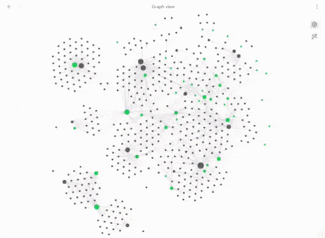

# Properties to Graph
 

 
This plugin allows you to chose frontmatter properties and add them as virtual nodes in Obsidian's graph view, so notes group visually by property instead of only by tags or links.
 
## Features
 
- Pick one or more frontmatter properties; each unique value becomes its own graph node, in its own colour.
- Click a property node to filter the graph, just like clicking a tag.
- Shift+click a property node to fold its notes; shift+click again to unfold.
- Rename a property's display name and toggle it on/off from the graph's own Filters panel.
- Optional node sizing based on how many notes are grouped underneath.

## Example

As an example adding `department` creates a `Digital` node in that property's colour. Adding `topics` creates `Data` and `AI` nodes in its own colour, both connected to the note.
```yaml
---
department: Digital
topics:
  - Data
  - AI
---
```

## Installation

1. Download `main.js` and `manifest.json` from the [latest release](https://github.com/clintjb/Properties-To-Graph/releases).
2. Place both files in `<your-vault>/.obsidian/plugins/properties-to-graph/`.
3. Enable **Properties to Graph** under Settings → Community plugins.
4. Open Settings → Properties to Graph.
5. Click **Add property** for each frontmatter property you want to visualise, choosing a property, name and colour for each.
6. Open Graph View.

## Development
 
```bash
npm install
npm run build
```
`npm run dev` starts an esbuild watcher. `npm run build` type-checks and produces `main.js`


## Notes

This is an experimental plugin and relies on Obsidian's internal Graph View renderer APIs, which are not part of the public `obsidian` package types and can change between Obsidian releases.

This project was originally inspired by the graph-injection approach used by [Folders to Graph](https://github.com/ratibus11/folders2graph) although the codebase has since been rewritten independently around frontmatter properties rather than folders.
